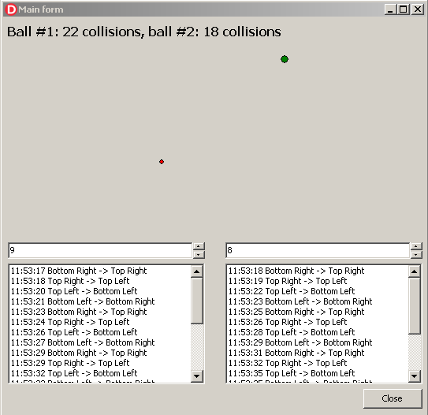

# Tutorial: Create the Flying Balls Application

>**Note**
>
>This article applies to Embarcadero® Delphi 10.4 and may be inapplicable to other versions or development software.
>
>You can find the source code of this tutorial application in the GitHub [repository](https://github.com/Sir-Derryk/PSWorkSearch/tree/main/DevSoft/Test%20task/Delphi%20project).

This tutorial is intended for developers who have basic skills in Embarcadero Delphi 10.4. In this tutorial, you build a **Flying Ball** application that displays two bouncing balls and logs their movement.

Each ball moves under 45 degrees angle. When the ball reaches a border, it changes direction.

You will use a custom control based on **TPaintBox** to display each of the flying balls. To set up a speed for each ball, you will use associated edit and up-down controls. To display the log of the balls' movement, you will use the following controls:

* two list boxes to display the bounces' history for each ball
* a label to display the count of collisions for both balls

When you finish, your application will look like the following picture:  

To create the application, perform the following steps:

1. [Create a form](Steps\Step1CreateForm.md).
2. [Create a custom control](Steps\Step2CreateCustomControl.md).
3. [Add the custom control to the form and set up interaction](Step3AddCCToFormAndSetUpInteraction.md).
4. Build the project and run the application.
